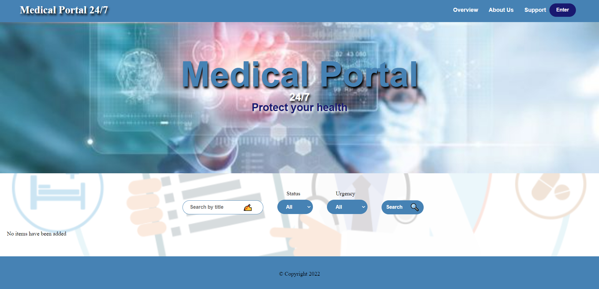

# During the development of the project, the following technologies were developed:
* HTML using semantic tags;
* Mobile first;
* Adaptive and responsive design
* CSS припроцесор SASS SCSS:
    * _Media qery;_
    * _Variables;_
    * _Mixin_;
* NPM and its modules;
* AJAX requests (fetch);
* ES6 modules;
* Used class in code;
___

# The composition of the project developers:
* ___Porada Vitalina___
* ___Inna Kurylo___
* ___Kletskyi Bohdan___
___

# List of completed works:
* __Porada Vitalina__: 
    * Made the config file for the bundler and supervised its work
    * Did an add visit modal for different doctors in HTML and SCSS
    * Worked with doctors' classes scripts
    * Made cards in scss
    * Made show more logic in the cards
    * Made edit logic in the cards 
    * Worked on getting token logic via login modal and its navigation through the project
* __Inna Kyrilo__:
    * Made a basic HTML and SCSS skeleton of the project
    * Set up a project architecture (files and directories)
    * Made filter bar in SCSS
    * Made the whole filter logic
    * Made loading of all cards logic after authorisation
    * Worked on getting token logic via login modal and its navigation through the project
    * Worked on drag and drop logic 
    * Worked on validation of requests
* __Kletskyi Bohdan__:
    * Made login modal in Scss and HTML
    * Made delete request in the cards
    * Made cleaning inputs after creating visit
    * Worked on getting token logic via login modal and its navigation through the project
    * Worked on drag and drop logic
    * Worked on validation of requests
___

___
# To start the project, use the following commands:
    1. npm i
    2. npm run build
    3. npm start
